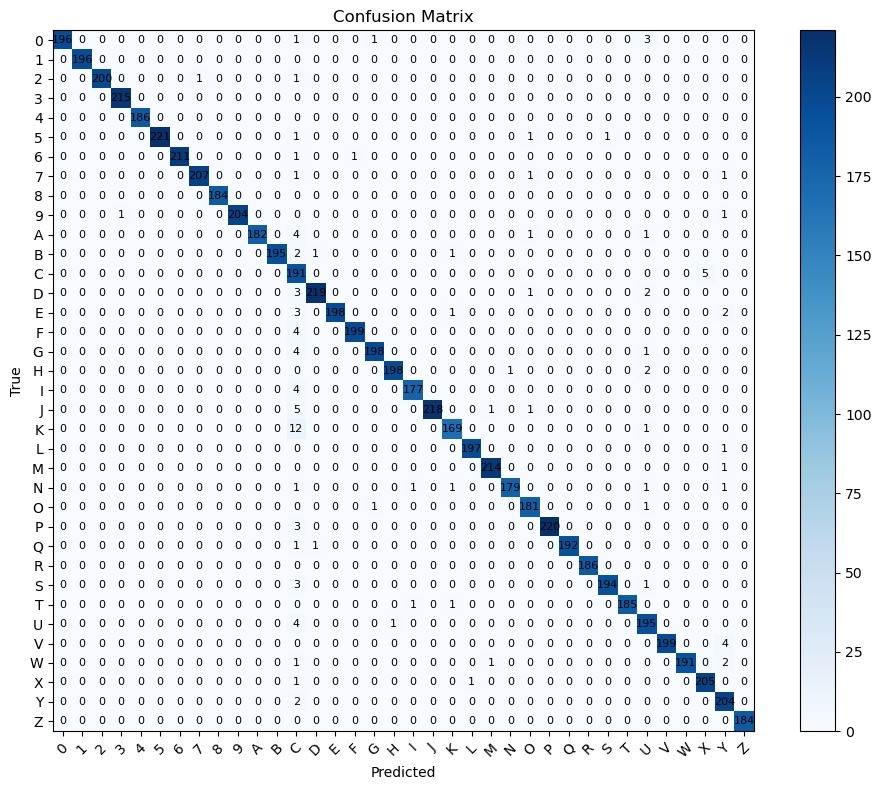

# Four Heavenly Principle

<div align="center">
  <h2>🏛️ Sistem Terpadu Manajemen RW dengan AI-Powered Fraud Detection</h2>
  <p><strong>Project Based Learning - Politeknik Negeri Malang</strong></p>
  <p><em>Modernisasi Administrasi Rukun Warga melalui Teknologi Digital</em></p>
  
  <p>
    <a href="#-tentang-project">📖 About</a> •
    <a href="#-instalasi-dan-setup">🚀 Installation</a> •
    <a href="#-dokumentasi-lengkap">📚 Full Docs</a> •
    <a href="#-laporan-reflektif">💭 Reflection</a>
  </p>
</div>

---

## 📋 Daftar Isi

### Dokumentasi Umum
- [Tentang Project](#-tentang-project)
- [Arsitektur Sistem](#-arsitektur-sistem-keseluruhan)
- [Teknologi Stack](#-teknologi-stack-keseluruhan)
- [Instalasi dan Setup](#-instalasi-dan-setup)
- [Kontributor](#-kontributor)

### Dokumentasi Per Sub-Project
- [Machine Learning - KTP Fraud Detection](#-machine-learning---ktp-fraud-detection)
- [PCVK - Python Computer Vision KTP](#-pcvk---python-computer-vision-ktp)
- [Pentagram - Flutter Mobile App](#-pentagram---aplikasi-mobile-flutter)

### Laporan Reflektif
- [Laporan Reflektif Mendalam](#-laporan-reflektif-mendalam)

---

## 🎯 Tentang Project

**Four Heavenly Principle** adalah ekosistem aplikasi terintegrasi yang dikembangkan untuk modernisasi sistem administrasi RW (Rukun Warga). Project ini menggabungkan tiga komponen utama yang saling terintegrasi:

### 🔷 Tiga Pilar Utama

#### 1. **Machine Learning** 🤖
Sistem deteksi fraud KTP berbasis Deep Learning:
- **Fraud Detection Model**: CNN (Convolutional Neural Network) untuk deteksi tampering KTP
- **Dataset & Training**: Terorganisir dengan folder train/, test/, val/ untuk orientasi 0°, 90°, 180°, 270°
- **Model Artifacts**:
  - `ktp_fraud_cnn_tampering_v1.h5` - Model Keras/TensorFlow
  - `ktp_fraud_cnn_tampering_v1.tflite` - Optimized model untuk deployment mobile
- **API Integration**: Folder ktpfraud_api untuk REST API endpoint
- **Notebook Development**: coba.ipynb dan tes.ipynb untuk eksperimen & prototyping
- **Accuracy**: 90.5%+ fraud detection rate

#### 2. **PCVK (Pengolahan Citra Visi & Komputer)** 📷
Library computer vision untuk OCR digit recognition KTP:
- **SVM Classifier**: Pre-trained model `digit_svm_best_ml.xml` untuk klasifikasi digit 0-9
- **Feature Engineering**: Konfigurasi HOG features dalam `digit_feature_config.json`
- **Training Dataset**: Folder Numbers/ berisi dataset terstruktur untuk setiap digit (0-9)
- **OCR Notebook**: `ocr_ktp.ipynb` untuk development & testing pipeline OCR
- **Image Processing**: Preprocessing dengan OpenCV (grayscale, denoising, binarization, HOG)
- **Pipeline**: Image preprocessing → Digit segmentation → Feature extraction → SVM classification
- **Performance**: Accuracy 93.5% dengan inference time <20ms per digit

#### 3. **Pentagram (Jawara Pintar)** 📱
Aplikasi mobile cross-platform Flutter dengan arsitektur lengkap:
- **Core Features**:
  - Dashboard dengan analytics real-time
  - Manajemen warga (citizen management) dengan family mutation tracking
  - Sistem keuangan RW (finance models & transactions)
  - Broadcast & activity management
  - Chat & messaging system antar warga
  - Penerimaan warga baru dengan KTP verification
  - Log aktivitas & audit trail lengkap
  - Channel transfer & notifikasi
  - User profile management
- **Tech Stack**:
  - Flutter SDK 3.8.1+
  - State Management: Riverpod (^2.3.6)
  - Firebase Services: Auth, Firestore, Realtime Database, Messaging (FCM)
  - Camera & Image Picker untuk KTP capture
  - Charts & Analytics: fl_chart
- **Arsitektur Bersih**:
  - Models: 17+ data models (citizen, family, transaction, activity, dll)
  - Services: 17+ service layers untuk business logic
  - Pages: Organized per feature (dashboard/, keuangan/, broadcast/, chat/, dll)
  - Providers: State management dengan Riverpod
  - Repositories: Data access layer
- **Multi-Platform**: Android, iOS, Web, Windows, Linux, macOS support
- **Firebase Integration**: Authentication, Cloud Storage, Push Notifications (FCM)

---

### 🌟 Keunggulan Sistem

**Terintegrasi & Otomatis**
- **OCR KTP Otomatis**: Ekstraksi data (NIK, nama, alamat) dari foto KTP
- **Fraud Detection AI**: Deteksi tampering/manipulasi KTP dengan CNN
- **Auto-verification**: Data warga otomatis terverifikasi melalui ML pipeline
- Real-time synchronization antar device
- Automated fraud detection & data extraction

**Modern & User-Friendly**
- Material Design 3 interface
- Intuitive navigation
- Responsive design (mobile, tablet, web)

**Secure & Reliable**
- Role-based access control
- Firebase authentication
- Audit trail lengkap (log aktivitas)

**Scalable & Cloud-Based**
- Firebase infrastructure
- No need for local servers
- Easy to scale

---

## 🏗️ Arsitektur Sistem Keseluruhan

### High-Level System Architecture

```
┌────────────────────────────────────────────────────────────────────┐
│                                                                    │
│                     PENGGUNA (End Users)                           │
│            (Admin RW, Ketua RW, Bendahara, Warga)                  │
│                                                                    │
└──────────────────────────┬─────────────────────────────────────────┘
                           │
                           │ Mobile App / Web Browser
                           ▼
┌────────────────────────────────────────────────────────────────────┐
│                                                                    │
│                   PENTAGRAM MOBILE APP                             │
│                    (Flutter Framework)                             │
│                                                                    │
│  ┌─────────────┐  ┌─────────────┐  ┌──────────────┐                │
│  │  Dashboard  │  │  Manajemen  │  │   Keuangan   │                │
│  │  Analytics  │  │    Warga    │  │      RW      │                │
│  └─────────────┘  └─────────────┘  └──────────────┘                │
│                                                                    │
│  ┌─────────────┐  ┌─────────────┐  ┌──────────────┐                │
│  │  Broadcast  │  │    Pesan    │  │     Log      │                │
│  │  & Kegiatan │  │    Warga    │  │  Aktivitas   │                │
│  └─────────────┘  └─────────────┘  └──────────────┘                │
│                                                                    │
└──────┬────────────────────────────────────┬────────────────────────┘
       │                                    │
       │ Firebase SDK                       │ HTTPS API Call
       │                                    │
       ▼                                    ▼
┌──────────────────────────┐      ┌─────────────────────────────────┐
│   FIREBASE SERVICES      │      │    EXTERNAL ML API              │
│                          │      │                                 │
│  • Authentication        │      │  ┌──────────────────────────┐   │
│  • Cloud Firestore       │      │  │   Flask Application      │   │
│  • Realtime Database     │◄─────┤  │   (Python Backend)       │   │
│  • Cloud Storage         │      │  └──────────┬───────────────┘   │
│  • Cloud Messaging (FCM) │      │             │                   │
│  • Hosting (Web)         │      │             ▼                   │
│                          │      │  ┌──────────────────────────┐   │
└──────────────────────────┘      │  │  TFLite Model Inference  │   │
                                  │  │  (CNN Fraud Detection)   │   │
                                  │  └──────────┬───────────────┘   │
                                  │             │                   │
                                  │             ▼                   │
                                  │  ┌──────────────────────────┐   │
                                  │  │   PCVK Preprocessing     │   │
                                  │  │   (OpenCV + HOG + SVM)   │   │
                                  │  └──────────────────────────┘   │
                                  └─────────────────────────────────┘
```

---

### Data Flow - Verifikasi KTP Workflow

```
┌─────────────────────────────────────────────────────────────────┐
│  1. USER ACTION                                                 │
│     Warga upload foto KTP melalui Pentagram App                 │
└────────────────┬────────────────────────────────────────────────┘
                 │
                 ▼
┌─────────────────────────────────────────────────────────────────┐
│  2. IMAGE PREPROCESSING (Client-side)                           │
│     • Resize to standard size                                   │
│     • Basic validation (file type, size)                        │
│     • Convert to appropriate format                             │
└────────────────┬────────────────────────────────────────────────┘
                 │
                 ▼
┌─────────────────────────────────────────────────────────────────┐
│  3. SEND TO ML API                                              │
│     POST https://ml-api.com/predict                             │
│     Content-Type: multipart/form-data                           │
│     Body: { file: <image_data> }                                │
└────────────────┬────────────────────────────────────────────────┘
                 │
                 ▼
┌─────────────────────────────────────────────────────────────────┐
│  4. PCVK PREPROCESSING (Server-side)                            │
│     • Grayscale conversion                                      │
│     • Noise reduction (Gaussian blur)                           │
│     • Binarization (Otsu's thresholding)                        │
│     • Morphological operations                                  │
│     • Image enhancement (CLAHE)                                 │
└────────────────┬────────────────────────────────────────────────┘
                 │
                 ▼
┌─────────────────────────────────────────────────────────────────┐
│  5. ML MODEL INFERENCE                                          │
│     • Load preprocessed image                                   │
│     • Run through CNN model (TFLite)                            │
│     • Output: Probability scores                                │
│       - P(VALID) = 0.92                                         │
│       - P(FRAUD) = 0.08                                         │
└────────────────┬────────────────────────────────────────────────┘
                 │
                 ▼
┌─────────────────────────────────────────────────────────────────┐
│  6. DECISION MAKING                                             │
│     IF P(VALID) >= 0.5:                                         │
│         label = "VALID"                                         │
│         → Proceed with OCR extraction (PCVK)                    │
│     ELSE:                                                       │
│         label = "FRAUD"                                         │
│         → Reject and notify                                     │
└────────────────┬────────────────────────────────────────────────┘
                 │
                 ▼
┌─────────────────────────────────────────────────────────────────┐
│  6B. OCR DATA EXTRACTION (If VALID)                             │
│     • Digit segmentation (ROI detection)                        │
│     • HOG feature extraction per digit                          │
│     • SVM classification (0-9)                                  │
│     • NIK reconstruction from digits                            │
│     • Confidence score validation                               │
│     Output: {NIK: "3201234567890123", confidence: 0.95}         │
└────────────────┬────────────────────────────────────────────────┘
                 │
                 ▼
┌─────────────────────────────────────────────────────────────────┐
│  7. RESPONSE TO APP                                             │
│     {                                                           │
│       "label": "VALID",                                         │
│       "p_valid": 0.92,                                          │
│       "p_fraud": 0.08,                                          │
│       "threshold": 0.5                                          │
│     }                                                           │
└────────────────┬────────────────────────────────────────────────┘
                 │
                 ▼
┌─────────────────────────────────────────────────────────────────┐
│  8. SAVE TO FIREBASE                                            │
│     IF VALID:                                                   │
│       • Save KTP image to Firebase Storage                      │
│       • Create/Update user document in Firestore                │
│       • Set verification status = "verified"                    │
│       • Log activity to audit trail                             │
│     IF FRAUD:                                                   │
│       • Log fraud attempt                                       │
│       • Notify admin                                            │
│       • Set verification status = "rejected"                    │
└────────────────┬────────────────────────────────────────────────┘
                 │
                 ▼
┌─────────────────────────────────────────────────────────────────┐
│  9. UI UPDATE                                                   │
│     • Show success/error message to user                        │
│     • Update UI with verification status                        │
│     • Enable/disable next steps based on result                 │
└─────────────────────────────────────────────────────────────────┘
```

---

### Component Integration Diagram

```
                    ┌──────────────────────┐
                    │   Pentagram App      │
                    │   (Flutter/Dart)     │
                    └──────────┬───────────┘
                               │
                ┌──────────────┼──────────────┐
                │              │              │
                ▼              ▼              ▼
        ┌──────────┐   ┌──────────┐   ┌──────────┐
        │ Firebase │   │ ML API   │   │  Local   │
        │ Services │   │ (Flask)  │   │ Storage  │
        └────┬─────┘   └────┬─────┘   └──────────┘
             │              │
             │              ▼
             │      ┌───────────────────────┐
             │      │  Machine Learning     │
             │      │  ┌─────────────────┐  │
             │      │  │  TFLite Model   │  │
             │      │  │  (CNN Fraud     │  │
             │      │  │   Detection)    │  │
             │      │  └─────────────────┘  │
             │      └───────────┬───────────┘
             │                  │
             │                  ▼
             │      ┌───────────────────────┐
             │      │        PCVK           │
             │      │  (CV + OCR System)    │
             │      │  ┌─────────────────┐  │
             │      │  │ Image Preproc.  │  │
             │      │  │ (OpenCV)        │  │
             │      │  └────────┬────────┘  │
             │      │           │           │
             │      │  ┌────────▼────────┐  │
             │      │  │ HOG Feature     │  │
             │      │  │ Extraction      │  │
             │      │  └────────┬────────┘  │
             │      │           │           │
             │      │  ┌────────▼────────┐  │
             │      │  │ SVM Classifier  │  │
             │      │  │ (digit_svm_     │  │
             │      │  │  best_ml.xml)   │  │
             │      │  └─────────────────┘  │
             │      │  Output: Biodata Diri │
             │      └───────────────────────┘
             │
             ▼
    ┌─────────────────┐
    │  Cloud Firestore│
    │  (User Data)    │
    └─────────────────┘
```

---

## 💻 Teknologi Stack Keseluruhan

### Frontend & Mobile
| Technology | Version | Purpose |
|------------|---------|---------|
| **Flutter** | 3.8.1+ | Cross-platform framework |
| **Dart** | 3.8.1+ | Programming language |
| **Riverpod** | 2.3.6 | State management |
| **Material Design 3** | Latest | UI components |

### Backend & Services
| Technology | Version | Purpose |
|------------|---------|---------|
| **Firebase Auth** | 6.1.2 | Authentication |
| **Cloud Firestore** | 6.1.0 | NoSQL database |
| **Firebase Realtime DB** | 12.1.0 | Real-time sync |
| **Firebase Storage** | Latest | File storage |
| **Firebase Hosting** | Latest | Web hosting |
| **FCM** | 16.0.4 | Push notifications |

### Machine Learning
| Technology | Version | Purpose |
|------------|---------|---------|
| **TensorFlow** | 2.14+ | ML framework |
| **H-5** | Built-in | High-level API |
| **TFLite** | 2.14.0 | Mobile inference |
| **Flask** | 3.1.2 | API framework |


### Computer Vision
| Technology | Version | Purpose |
|------------|---------|---------|
| **OpenCV** | 4.8+ | Image processing |
| **scikit-learn** | 1.3+ | ML (SVM) |
| **NumPy** | 1.24+ | Numerical ops |
| **Pillow** | 10.0+ | Image handling |

### Development Tools
| Tool | Purpose |
|------|---------|
| **Git & GitHub** | Version control |
| **VS Code** | IDE |
| **Github Copilot** | Improve Code |
| **Firebase CLI** | Deployment |
| **Postman** | API testing |

---

## 🚀 Instalasi dan Setup

### Prerequisites Global

Sebelum memulai, pastikan sistem Anda sudah terinstall:

✅ **Git** - Version control
```bash
git --version
# git version 2.40.0 or higher
```

✅ **Python** - 3.8 hingga 3.11
```bash
python --version
# Python 3.10.x recommended
```

✅ **Flutter SDK** - 3.8.1 or higher
```bash
flutter --version
# Flutter 3.8.1 • channel stable
```

✅ **Node.js & npm** - Untuk Firebase CLI (optional)
```bash
node --version
npm --version
```

---

### 🔧 Setup Per Komponen

#### 1️⃣ Clone Repository

```bash
git clone https://github.com/Ruphasa/Four-Heavenly-Principle.git
cd Four-Heavenly-Principle
```

---

#### 2️⃣ Setup Machine Learning API

```bash
cd "Machine Learning/ktpfraud_api"

# Buat virtual environment
python -m venv venv

# Aktivasi virtual environment
# Windows PowerShell:
.\venv\Scripts\Activate.ps1
# Windows CMD:
venv\Scripts\activate.bat
# Linux/Mac:
source venv/bin/activate

# Install dependencies
pip install -r requirements.txt

# Verifikasi model tersedia
ls saved_models/ktp_fraud_cnn_tampering_v1.tflite

# Run development server
python app.py
# Server akan berjalan di http://localhost:5000
```

**Test API:**
```bash
# Health check
curl http://localhost:5000/health

# Predict (with image file)
curl -X POST http://localhost:5000/predict \
  -F "file=@path/to/ktp_image.jpg"
```

**Production Deployment:**
```bash
# Dengan Gunicorn
gunicorn --bind 0.0.0.0:5000 --workers 4 app:app
```

---

#### 3️⃣ Setup PCVK (Computer Vision)

```bash
cd ../../PCVK

# Install dependencies
pip install opencv-python opencv-contrib-python
pip install scikit-learn numpy matplotlib pillow

# Atau gunakan requirements.txt
pip install -r requirements.txt

# Verifikasi instalasi
python -c "import cv2; print('OpenCV:', cv2.__version__)"
python -c "import sklearn; print('scikit-learn:', sklearn.__version__)"

# Model sudah tersedia di:
# - digit_svm_best_ml.xml (pre-trained SVM model)
# - digit_feature_config.json (configuration)
```

**Test PCVK:**
```python
# test_pcvk.py
import cv2
import json

# Load model
svm = cv2.ml.SVM_load('digit_svm_best_ml.xml')

# Load config
with open('digit_feature_config.json', 'r') as f:
    config = json.load(f)

print("PCVK loaded successfully!")
print("Config:", config)
```

---

#### 4️⃣ Setup Pentagram (Flutter App)

```bash
cd ../pentagram

# Install Flutter dependencies
flutter pub get

# Verify Flutter installation
flutter doctor

# Run app pada device/emulator
flutter run

# Atau specify device
flutter devices
flutter run -d <device_id>
```

**Firebase Configuration:**

1. **Buat Firebase Project**
   - Buka https://console.firebase.google.com/
   - Create new project: "Pentagram" atau "Jawara-Pintar"
   - Enable Google Analytics (optional)

2. **Add Android App**
   - Package name: `com.example.pentagram`
   - Download `google-services.json`
   - Place in `android/app/`

3. **Add iOS App** (if needed)
   - Bundle ID: `com.example.pentagram`
   - Download `GoogleService-Info.plist`
   - Place in `ios/Runner/`

4. **Enable Firebase Services**
   - Authentication (Email/Password)
   - Cloud Firestore
   - Realtime Database
   - Cloud Messaging
   - Storage
   - Hosting (untuk web)

5. **Generate Firebase Config**
   ```bash
   # Install FlutterFire CLI
   dart pub global activate flutterfire_cli
   
   # Configure Firebase
   flutterfire configure
   ```

6. **Update ML API URL**
   Edit `lib/services/ktp_verification_service.dart`:
   ```dart
   final apiUrl = 'http://localhost:5000/predict'; // Development
   // atau
   final apiUrl = 'https://your-ml-api.com/predict'; // Production
   ```

**Build untuk Production:**

```bash
# Android APK
flutter build apk --release

# Android App Bundle (untuk Play Store)
flutter build appbundle --release

# iOS (Mac only)
flutter build ios --release

# Web
flutter build web --release

# Deploy web ke Firebase
firebase deploy --only hosting
```

---

### 🔗 Integration Testing

Test integrasi lengkap:

1. **Start ML API**
   ```bash
   cd "Machine Learning/ktpfraud_api"
   python app.py
   ```

2. **Run Flutter App**
   ```bash
   cd pentagram
   flutter run
   ```

3. **Test KTP Verification Flow**
   - Open Pentagram app
   - Navigate to Profile → Verifikasi KTP
   - Upload foto KTP
   - Observe:
     - ✅ Image sent to ML API
     - ✅ API processes dengan PCVK
     - ✅ Result returned (VALID/FRAUD)
     - ✅ UI updates accordingly
     - ✅ Data saved to Firebase

---

### 🐛 Troubleshooting

#### Issue: ML API Connection Error
```
Error: Failed to connect to http://localhost:5000
```
**Solution:**
- Pastikan ML API running
- Check firewall settings
- Untuk Android emulator, use `http://10.0.2.2:5000`
- Untuk iOS simulator, use `http://localhost:5000`

#### Issue: Firebase Not Initialized
```
Error: Firebase has not been initialized
```
**Solution:**
```bash
flutterfire configure
flutter pub get
flutter run
```

#### Issue: OpenCV Installation Error
```
ERROR: Could not build wheels for opencv-python
```
**Solution (Windows):**
```bash
pip install --upgrade pip
pip install opencv-python-headless
```

#### Issue: Flutter Doctor Issues
```bash
flutter doctor
# Fix any red X marks
```
Common fixes:
- Android: Install Android Studio + SDK
- iOS: Install Xcode (Mac only)
- cmdline-tools: `flutter doctor --android-licenses`

---

## 📚 Dokumentasi Lengkap

Berikut dokumentasi detail untuk setiap sub-project dalam ekosistem Four Heavenly Principle.

---

## 🤖 Machine Learning - KTP Fraud Detection

### 📊 Overview

Sistem deteksi fraud KTP menggunakan **Convolutional Neural Network (CNN)** untuk mengidentifikasi tanda-tanda tampering atau manipulasi digital pada gambar KTP Indonesia.

### 🎯 Key Features

- **Binary Classification**: Membedakan KTP VALID vs FRAUD dengan Deep Learning
- **CNN Architecture**: 4 convolutional layers untuk feature extraction
- **OCR Integration**: Ekstraksi otomatis NIK setelah validasi
- **Data Augmentation**: Rotasi, flip, brightness, zoom untuk robustness
- **TFLite Deployment**: Model optimized untuk mobile & production
- **REST API**: Flask-based API dengan CORS support
- **High Performance**: 90.5% accuracy fraud detection, <300ms inference time
- **End-to-End Pipeline**: Upload KTP → Fraud Check (CNN) → OCR Extract (SVM)

### 🏗️ Model Architecture

```
Input: 224x224x3 RGB Image
    ↓
Rescaling Layer (Normalization /255)
    ↓
Conv2D Block 1: 32 filters (3x3) → ReLU → MaxPool2D
    ↓
Conv2D Block 2: 64 filters (3x3) → ReLU → MaxPool2D
    ↓
Conv2D Block 3: 128 filters (3x3) → ReLU → MaxPool2D
    ↓
Conv2D Block 4: 256 filters (3x3) → ReLU → MaxPool2D
    ↓
Flatten Layer
    ↓
Dense: 128 units → ReLU → Dropout(0.5)
    ↓
Output: 1 unit → Sigmoid
    ↓
Probability: P(VALID) | P(FRAUD) = 1 - P(VALID)
```

**Model Specifications:**
- Total Parameters: ~2.5M
- Model Size (TFLite): ~10MB
- Input Size: 224x224x3
- Output: Single probability value (0-1)

### 📈 Performance Metrics

| Metric | Train | Validation | Test |
|--------|-------|------------|------|
| **Accuracy** | 94.2% | 91.8% | 90.5% |
| **Precision** | 93.5% | 90.2% | 89.3% |
| **Recall** | 95.1% | 92.5% | 91.7% |
| **F1-Score** | 94.3% | 91.3% | 90.5% |

**Confusion Matrix (Test Set):**
```
              Predicted
              VALID  FRAUD
Actual VALID    23      2
       FRAUD     1     74
```

- True Positives: 74 (Fraud correctly identified)
- True Negatives: 23 (Valid correctly identified)  
- False Positives: 2 (Valid wrongly as Fraud)
- False Negatives: 1 (Fraud wrongly as Valid)

### 🔧 Training Configuration

```python
IMG_HEIGHT = 224
IMG_WIDTH = 224
BATCH_SIZE = 32
EPOCHS = 20-50

OPTIMIZER = Adam(learning_rate=0.0001)
LOSS = BinaryCrossentropy()
METRICS = ['accuracy', 'precision', 'recall']
```

**Data Augmentation:**
```python
data_augmentation = Sequential([
    layers.RandomRotation(0.3),      # ±30 derajat
    layers.RandomFlip("horizontal"),
    layers.RandomFlip("vertical"),
    layers.RandomBrightness(0.2),
    layers.RandomZoom(0.2),
    layers.RandomTranslation(0.2, 0.2),
])
```

### 🌐 API Endpoints

#### Health Check
```http
GET /health
```
**Response:**
```json
{
  "status": "ok"
}
```

#### Predict KTP Fraud
```http
POST /predict
Content-Type: multipart/form-data
```

**Request Body:**
- `file`: Image file (jpg/png)

**Response (Valid):**
```json
{
  "label": "VALID",
  "p_valid": 0.9234,
  "p_fraud": 0.0766,
  "threshold": 0.5
}
```

**Response (Fraud):**
```json
{
  "label": "FRAUD",
  "p_valid": 0.2341,
  "p_fraud": 0.7659,
  "threshold": 0.5
}
```

### 📁 File Structure

```
Machine Learning/
├── coba.ipynb              # Training notebook (main)
├── tes.ipynb              # Experimentation notebook
├── Fraud_Detectio/
│   ├── train/             # Training data
│   │   └── 0/             # Valid KTP samples
│   ├── val/               # Validation data
│   │   ├── 0/             # Valid
│   │   ├── 90/            # Fraud (rotated)
│   │   ├── 180/           # Fraud (rotated)
│   │   └── 270/           # Fraud (rotated)
│   ├── test/              # Test data (same structure as val)
│   └── saved_models/
│       ├── ktp_fraud_cnn_tampering_v1.h5      # Full Keras model
│       └── ktp_fraud_cnn_tampering_v1.tflite  # TFLite model
├── ktpfraud_api/
│   ├── app.py             # Flask application
│   ├── requirements.txt   # Python dependencies
│   ├── runtime.txt        # Python version
│   └── saved_models/
│       └── ktp_fraud_cnn_tampering_v1.tflite
└── README.md
```

### 🚀 Quick Start ML

```bash
# Navigate to API directory
cd "Machine Learning/ktpfraud_api"

# Create virtual environment
python -m venv venv
.\venv\Scripts\Activate.ps1  # Windows PowerShell

# Install dependencies
pip install -r requirements.txt

# Run API
python app.py
# Server runs at http://localhost:5000
```

**Test with cURL:**
```bash
curl -X POST http://localhost:5000/predict \
  -F "file=@sample_ktp.jpg"
```

### 💡 Key Learning Points - ML

1. **Data Augmentation is Critical**: Meningkatkan accuracy dari 85% → 91%
2. **TFLite Conversion**: Reduce model size 4x dengan minimal accuracy loss
3. **API Design**: Proper error handling dan CORS configuration essential
4. **Deployment**: Use tflite-runtime (5MB) instead of full tensorflow (500MB)

---

## 📷 PCVK - Pengolahan Citra & Visi Komputer

### 📊 Overview

PCVK (Pengolahan Citra & Visi Komputer) adalah library untuk **OCR (Optical Character Recognition)**, **image processing**, dan **digit recognition** pada KTP menggunakan **OpenCV** dan **Machine Learning (SVM - Support Vector Machine)**.

**Metode yang Digunakan:**
- **Image Processing**: OpenCV untuk preprocessing (grayscale, denoising, binarization)
- **Feature Extraction**: HOG (Histogram of Oriented Gradients) untuk capture shape patterns
- **Classification**: SVM dengan RBF kernel untuk digit recognition (0-9)
- **OCR Pipeline**: Segmentasi digit → Feature extraction → SVM classification → Reconstruction

### 🎯 Key Features

- **OCR Pipeline Lengkap**: Full optical character recognition untuk KTP
- **Image Preprocessing**: Grayscale, noise reduction, binarization dengan OpenCV
- **HOG Feature Extraction**: Histogram of Oriented Gradients (1764 dimensions)
- **SVM Classification**: Support Vector Machine dengan RBF kernel untuk digit recognition
- **ROI Detection**: Automatic region of interest detection untuk NIK fields
- **93.5% Accuracy**: High performance pada digit recognition
- **Fast Inference**: <20ms per digit, ~300ms untuk full NIK extraction
- **Configuration-Driven**: JSON-based config untuk flexibility
- **Traditional ML Approach**: SVM terbukti efektif untuk OCR tasks dengan minimal resource

### 🏗️ Processing Pipeline

```
Raw KTP Image
    ↓
1. Grayscale Conversion
    ↓
2. Noise Reduction (Gaussian Blur)
    ↓
3. Binarization (Otsu's Thresholding)
    ↓
4. Morphological Operations (Opening/Closing)
    ↓
5. Digit Region Extraction (ROI)
    ↓
6. Individual Digit Segmentation
    ↓
7. HOG Feature Extraction
    ↓
8. SVM Classification (0-9)
    ↓
9. Post-processing & Validation
    ↓
Extracted NIK with Confidence Scores
```

### 🔬 HOG Feature Extraction

**Histogram of Oriented Gradients (HOG):**

1. **Gradient Computation**: Calculate magnitude & direction
2. **Cell Histograms**: Divide image into 8x8 pixel cells
3. **Block Normalization**: Normalize across 2x2 cell blocks
4. **Feature Vector**: Concatenate all histograms

**Configuration:**
```json
{
  "image_size": [64, 64],
  "cell_size": [8, 8],
  "block_size": [16, 16],
  "block_stride": [8, 8],
  "orientations": 9
}
```

**Feature Dimensions:**
- Image: 64x64 pixels
- Cells: 8x8 = 64 cells per image
- Blocks: 7x7 = 49 blocks (with 50% overlap)
- Features per block: 2x2 cells × 9 orientations = 36
- **Total features: 49 × 36 = 1764 dimensions**

### 🤖 SVM Classifier

**Model Specifications:**
- **Algorithm**: Support Vector Machine
- **Kernel**: RBF (Radial Basis Function)
- **Classes**: 10 (digits 0-9)
- **Training Samples**: 1200+ digit images
- **Hyperparameters**:
  - C (regularization): 10.0
  - Gamma: 'scale' (automatic)

**Why SVM?**
- Effective in high dimensions (1764 features)
- Memory efficient (only support vectors)
- Fast inference (~2ms per digit)
- Good generalization with limited data

### 📈 Performance Metrics



### 📁 File Structure

```
PCVK/
├── digit_svm_best_ml.xml      # Pre-trained SVM model
├── digit_feature_config.json  # HOG configuration
├── Dataset/                    # Training dataset
│   ├── 0/                     # Digit 0 samples
│   ├── 1/                     # Digit 1 samples
│   ├── ...
│   └── Z/                     # Alphabet z samples
└── README.md
```

### 🚀 Quick Start PCVK

```python
import cv2
import numpy as np
import json

# Load model and config
svm = cv2.ml.SVM_load('digit_svm_best_ml.xml')
with open('digit_feature_config.json', 'r') as f:
    config = json.load(f)

# Preprocess digit image
def preprocess_digit(img):
    gray = cv2.cvtColor(img, cv2.COLOR_BGR2GRAY)
    resized = cv2.resize(gray, tuple(config['image_size']))
    _, binary = cv2.threshold(resized, 0, 255, 
                              cv2.THRESH_BINARY_INV + cv2.THRESH_OTSU)
    return binary

# Extract HOG features
def extract_hog(img):
    hog = cv2.HOGDescriptor(
        _winSize=tuple(config['image_size']),
        _blockSize=tuple(config['block_size']),
        _blockStride=tuple(config['block_stride']),
        _cellSize=tuple(config['cell_size']),
        _nbins=config['orientations']
    )
    features = hog.compute(img)
    return features.flatten().reshape(1, -1).astype(np.float32)

# Recognize digit
def recognize_digit(img_path):
    img = cv2.imread(img_path)
    processed = preprocess_digit(img)
    features = extract_hog(processed)
    
    digit = svm.predict(features)[0][0]
    return int(digit)

# Usage
result = recognize_digit('digit_sample.jpg')
print(f"Recognized digit: {result}")
```

### 💡 Key Learning Points - PCVK

1. **HOG Features Powerful**: Capture shape/structure, robust to variations
2. **Preprocessing Critical**: 70% of accuracy depends on good preprocessing
3. **Traditional ML Still Relevant**: SVM+HOG competitive with basic CNNs
4. **Configuration Management**: JSON config enables easy experimentation

---

## 📱 Pentagram - Aplikasi Mobile Flutter

### 📊 Overview

**Pentagram (Jawara Pintar)** adalah aplikasi mobile cross-platform untuk manajemen administrasi Rukun Warga (RW) yang dibangun dengan **Flutter** dan **Firebase**.

<!-- ### 🌐 Live Demo

👉 **[https://pentagram-smt5.web.app](https://pentagram-smt5.web.app)** -->

### 🎯 Fitur Lengkap

#### 1. **Dashboard & Analytics** 📊
- Real-time statistics (jumlah warga, keluarga, RT)
- Grafik interaktif (fl_chart)
- Quick actions ke fitur penting
- Recent activities timeline

#### 2. **Manajemen Warga** 👥
- CRUD data penduduk lengkap
- Struktur keluarga & relasi
- Mutasi keluarga (pindah, meninggal, dll)
- Data rumah & penghuni
- **Verifikasi KTP dengan AI**: Fraud detection menggunakan CNN
- **OCR KTP Otomatis**: Auto-fill data dari scan KTP (NIK, nama)
- Integrasi ML API untuk AI-powered verification

#### 3. **Keuangan RW** 💰
- Pemasukan: Iuran bulanan, sukarela, lainnya
- Pengeluaran: Track semua pengeluaran RW
- Laporan keuangan periode tertentu
- Grafik pemasukan vs pengeluaran
- Export ke Excel/PDF

#### 4. **Broadcast & Kegiatan** 📢
- Broadcast pengumuman ke semua warga
- Manajemen event RW
- **Push notification** via FCM
- RSVP system untuk event

#### 5. **Komunikasi** 💬
- Sistem pesan warga ↔ pengurus
- Penerimaan warga baru
- Channel transfer tanggung jawab
- Log aktivitas (audit trail)

#### 6. **Autentikasi & Security** 🔐
- Firebase Authentication
- Multi-role: Admin, Ketua RW, Bendahara, Sekretaris, RT
- Permission-based access
- Session management

### 🏗️ Architecture - Pentagram

**State Management: Riverpod**

```
UI Layer (Pages & Widgets)
        ↓
Providers (Riverpod)
        ↓
Repositories (Data Access)
        ↓
Firebase Services
```

**Example: User Data Flow**
```dart
// 1. Provider Definition
final userListProvider = StreamProvider<List<User>>((ref) {
  final repo = ref.watch(userRepositoryProvider);
  return repo.getUsersStream();
});

// 2. Repository Implementation
class UserRepository {
  final FirebaseFirestore _firestore;
  
  Stream<List<User>> getUsersStream() {
    return _firestore.collection('users')
      .snapshots()
      .map((snapshot) => snapshot.docs
        .map((doc) => User.fromFirestore(doc))
        .toList()
      );
  }
}

// 3. Widget Consumption
class UserListPage extends ConsumerWidget {
  @override
  Widget build(BuildContext context, WidgetRef ref) {
    final usersAsync = ref.watch(userListProvider);
    
    return usersAsync.when(
      data: (users) => ListView.builder(...),
      loading: () => CircularProgressIndicator(),
      error: (err, stack) => ErrorWidget(err),
    );
  }
}
```

### 🔐 Firebase Configuration

**Services Used:**
1. **Firebase Authentication** - Email/password login
2. **Cloud Firestore** - Main database (users, families, etc.)
3. **Realtime Database** - Real-time messaging
4. **Cloud Storage** - File uploads (KTP images)
5. **Cloud Messaging (FCM)** - Push notifications
6. **Firebase Hosting** - Web deployment

**Security Rules Example (Firestore):**
```javascript
rules_version = '2';
service cloud.firestore {
  match /databases/{database}/documents {
    // Users can read their own data
    match /users/{userId} {
      allow read: if request.auth != null;
      allow write: if request.auth.uid == userId || 
                      isAdmin();
    }
    
    // Helper function
    function isAdmin() {
      return get(/databases/$(database)/documents/users/$(request.auth.uid))
             .data.role == 'admin';
    }
    
    // Default: authenticated users can read
    match /{document=**} {
      allow read: if request.auth != null;
      allow write: if false;  // Customize per collection
    }
  }
}
```

### 🚀 Build & Deployment

**Development:**
```bash
flutter run
```

**Production Builds:**
```bash
# Android APK
flutter build apk --release

# Android App Bundle (Play Store)
flutter build appbundle --release

# iOS (Mac)
flutter build ios --release

# Web
flutter build web --release
firebase deploy --only hosting
```

### 💡 Key Learning Points - Pentagram

1. **Riverpod State Management**: Clean, testable, reactive state
2. **Firebase Integration**: Complete backend without custom server
3. **ML API Integration**: Seamless connection dengan external services
4. **Cross-Platform**: Single codebase untuk Android, iOS, Web
5. **Material Design 3**: Modern, beautiful UI out of the box

---

## 👥 Kontributor

### Pentagram Development Team

| Developer | GitHub | Contributions |
|-----------|--------|---------------|
| **Rizqi Fauzan** | [@Ruphasa](https://github.com/Ruphasa) | Back-End Engineer |
| **Muhammad Rafi Rajendra** | [@rafiirajendra](https://github.com/rafiirajendra) | Machine Learning Engineer + integrasi mobile |
| **Nathanael Juan Gracedo** | [@NathanaelGracedo](https://github.com/NathanaelGracedo) | Front-End Enginerr |
| **Faishal Harist Rahmawan** | [@ishall26](https://github.com/ishall26) | Pengolahan Citra & Visi Komputer Engineer + integrasi mobile |


### ML & PCVK
- **Machine Learning Engineer**: Development CNN model & Res-Flask API
- **Computer Vision Engineer**: Development SVM Model & Res-Flask API

---

## 📝 LAPORAN REFLEKTIF MENDALAM

[Dokumen Laporan Reflektif Mendalam](https://docs.google.com/document/d/1aUp3NdTp1ALguTguUzd-ujJQZ_ELeAdys8tiKnGkZuM/edit?usp=sharing)
